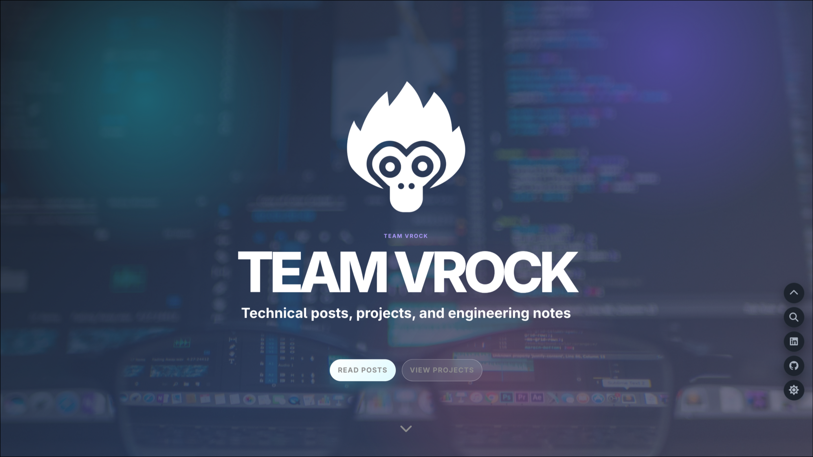

# Jekyll Theme VROCK



VROCK is a modern Jekyll theme for technical teams that want to publish engineering posts and showcase selected GitHub projects.

It provides a responsive hero, configurable navigation and social links, pinned project cards, post search, dark mode, themed syntax highlighting, copy buttons for code blocks, locally bundled Font Awesome assets, and GA4 Consent Mode v2 handling.

## Usage

```yml
remote_theme: team-vrock/jekyll-theme-vrock

plugins:
  - jekyll-remote-theme
```

Use a tag, commit SHA, or branch name without `/` when pinning a remote theme ref. `jekyll-remote-theme` does not accept slash characters in the `@ref` portion.

## Configuration

```yml
title: TEAM VROCK
username: TEAM VROCK
user_title: Technical posts, projects, and engineering notes
user_description: "TEAM VROCK publishes practical notes about cloud, DevOps, and engineering work."

hero:
  logo: /assets/img/logo.png

primary_cta:
  label: Read posts
  url: "#searchlist"
secondary_cta:
  label: View projects
  url: "#projects"

social_links:
  - label: LinkedIn
    url: "https://www.linkedin.com/company/vrock"
    icon: linkedin
  - label: GitHub
    url: "https://github.com/team-vrock"
    icon: github

github_projects:
  organization: team-vrock
  pinned_repositories:
    - jekyll-theme-vrock
    - team-vrock.github.io
```

If `_data/github_projects.yml` exists, the theme renders those enriched repository records. Otherwise it falls back to links generated from `github_projects.organization` and `github_projects.pinned_repositories`.

Expected project data shape:

```yml
- name: jekyll-theme-vrock
  description: Modern Jekyll theme for technical teams.
  language: Ruby
  html_url: https://github.com/team-vrock/jekyll-theme-vrock
  image: /assets/img/projects/jekyll-theme-vrock.png
  image_alt: jekyll-theme-vrock preview
```

## Code Blocks

Fenced code blocks use Rouge syntax highlighting and automatically follow the active light or dark theme. Each highlighted block gets a copy button without additional configuration.

## Search

Algolia search is optional and targets posts only. Configure it when your index is maintained separately:

```yml
algolia:
  enabled: true
  application_id: "..."
  index_name: "..."
  search_only_api_key: "..."
  powered_by: true
```

Algolia is loaded only when `JEKYLL_ENV=production`. Local development, including `bundle exec jekyll serve --drafts`, keeps the server-rendered `site.posts` list so unpublished drafts are visible during preview.

## Analytics

GA4 uses Google Consent Mode v2. The Google tag loads on every page with `analytics_storage`, `ad_storage`, `ad_user_data`, and `ad_personalization` denied by default. This allows limited cookieless measurement before consent without writing analytics cookies. When a visitor approves analytics, only `analytics_storage` changes to `granted` and the choice is stored in the configured consent cookie:

```yml
google-analytics:
  id: "G-XXXXXXXXXX"
```

## Development

```sh
bundle install
bundle exec jekyll build
bundle exec jekyll serve
bundle exec jekyll serve --drafts
```

## License

This theme is free and open source software distributed under the MIT License.
